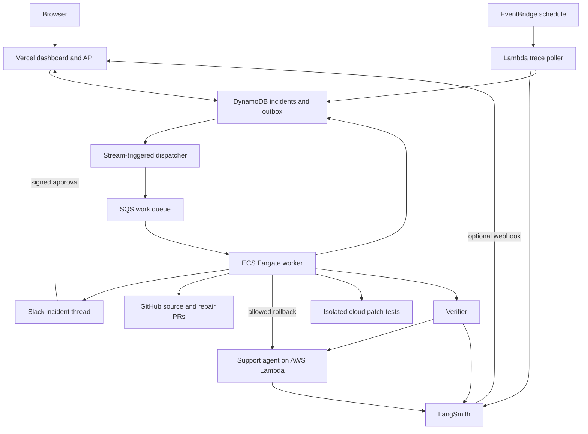

# GreenAgain

**Detect an AI regression. Dispatch a specialist. Verify recovery.**

GreenAgain is an incident-response system for production AI applications. It uses LangSmith evidence to investigate regressions, coordinates incidents in Slack, prepares repairs through GitHub, and restores approved application versions on AWS. Recovery is confirmed through fresh requests and evaluations before an incident is closed.

> **Build status: early implementation.** The dashboard and integration adapter source are present. The end-to-end incident engine, monitored AWS application, cloud infrastructure, and deployed recovery workflow are not yet implemented or verified. The architecture below describes the approved target system, not a live deployment.

**[Detailed implementation plan](plan.md)** · **[Repository](https://github.com/madhu-garudala/GreenAgain)**

**Continuing on another machine? Read [handoff_plan.md](handoff_plan.md) first.** It records the latest interrupted source changes, known defects, actual test outcomes, credential-transfer requirements, and prioritized next steps. It supersedes older build-status notes below; a monitored-agent scaffold and further UI edits were added after this README was initially written.

Live dashboard: not deployed yet.

Two-minute demo: not recorded yet.

## Why this exists

An AI application can become unreliable without crashing. A new prompt might stop consulting a policy, a tool response might change shape, or a release might produce incorrect answers while returning successful HTTP responses.

GreenAgain connects evidence to corrective action. Its job is to explain what changed, select an appropriate response, execute within a defined policy, and measure whether the affected application works again.

An opened pull request is a proposed repair. A successful rollback API call is an executed action. Neither is sufficient evidence that an incident is resolved.

## Two applications working together

The project separates the system doing the monitoring from the application being monitored.

### GreenAgain: the responder

GreenAgain owns the dashboard, incident records, specialist coordination, approvals, external actions, and verification. Its worker runs independently of the monitored application and of the user's browser.

### Support agent: the monitored application

The planned demo application is an AWS Lambda support agent that answers questions about fictional orders and returns. It uses tools to retrieve an order, read a policy, and check eligibility, then returns a structured answer with supporting references.

Its data is synthetic. It does not issue real refunds or contact customers. Published healthy and faulty releases make it possible to demonstrate real regressions and real recovery.

Example request:

> My headphones arrived damaged. Am I eligible for a replacement?

The healthy version should consult the relevant order and policy. A faulty release may skip that evidence or fail when reading a changed tool response.

## The external applications

| Integration | Role in GreenAgain | Planned interaction |
|---|---|---|
| **LangSmith** | Monitoring evidence and evaluations | Read traces; record feedback and verification experiments |
| **Slack** | Incident communication and approvals | Create an incident thread, update progress, accept authorized decisions |
| **GitHub** | Source changes and repair review | Inspect source/diffs, open repair PRs, read CI results |
| **AWS** | Application hosting and remediation | Run the monitored agent, restore verified versions, execute workers and isolated tests |
| **Vercel** | Public product interface | Host dashboard, lightweight APIs, and callback endpoints |

LangSmith, Slack, GitHub, and AWS are external services used by the agents. They are not themselves counted as GreenAgain's reasoning agents.

## Three agents plus independent verification

| Component | Responsibility | Boundary |
|---|---|---|
| **Orchestrator** | Collect evidence, classify the incident, and choose a specialist | Cannot freely execute deployments or arbitrary code |
| **Release recovery specialist** | Investigate release-associated regressions and propose a verified rollback target | Can only propose targets from the approved release catalog |
| **Code repair specialist** | Reproduce a failure, propose a narrow patch, and request testing | Cannot change protected acceptance tests or deployment permissions |
| **Verifier** | Run fixed evaluations and fresh deployed requests | Cannot propose repairs; failed critical checks cannot be overridden by an explanation |

Models interpret evidence and propose typed actions. Deterministic code validates those actions, enforces permissions, tracks execution, and decides whether the measured recovery criteria passed.

The Luna agents used to help implement this repository are development assistants. They are separate from the runtime agents described above; runtime model selection remains configurable.

## End-to-end incident flow

1. **A release changes the support agent.** AWS retains published versions and an alias identifies the active release.
2. **Requests produce LangSmith traces.** Evidence includes tool calls, outputs, errors, and release metadata.
3. **GreenAgain detects a regression.** A scheduled AWS process queries traces and evaluation feedback. Authenticated LangSmith webhooks are an additional planned input, subject to account capability checks.
4. **The incident is saved and queued.** Durable storage records the event before background work proceeds.
5. **Slack receives an incident thread.** Progress and subsequent outcomes stay attached to the same incident.
6. **The orchestrator investigates.** It compares failing and baseline evidence with relevant GitHub changes and deployment metadata.
7. **A specialist proposes a response.** It may propose a rollback, a code repair, or escalation when evidence is insufficient.
8. **Policy checks govern execution.** The exact target, current deployment state, and any required approval are checked before an action runs.
9. **The verifier tests the outcome.** New requests and a fixed dataset establish whether the affected behavior recovered.
10. **The incident resolves or escalates.** Slack and the dashboard show evidence, measurements, and remaining work.

## Fully cloud-hosted architecture

No laptop process, local database, tunnel, or local scheduled task will be required to operate the finished system.



| Cloud component | Purpose |
|---|---|
| Vercel | Dashboard, incident reads, operator controls, callback receipt |
| DynamoDB | Incident state, evidence references, action history, leases, approvals, release catalog |
| DynamoDB outbox and Streams | Persist event and pending job together; dispatch reliably |
| SQS and dead-letter queue | Deliver work and retain repeatedly failing jobs for investigation |
| ECS Fargate | Run investigations and remediation independently of request timeouts |
| Lambda and EventBridge | Run the monitored agent and scheduled detection/reconciliation |
| Separate Fargate test tasks | Execute candidate patches with a fixed harness and restricted access |
| ECR and private S3 | Store container images, source bundles, and test artifacts |
| Secrets Manager and runtime roles | Give each service only its required credentials and permissions |

Vercel requests acknowledge incoming events quickly. Long-running work continues in AWS. A browser closing or refreshing must not cancel an incident investigation.

## Planned demonstration scenarios

### 1. Prompt regression: recover a release

A new prompt causes unsupported return-policy answers. GreenAgain gathers traces and the prompt diff, then dispatches the release specialist. After checking that the target is a verified baseline and that no newer release has superseded the investigation, it restores the AWS alias.

Fresh requests and the protected evaluation suite must pass before the incident becomes `RESOLVED`.

### 2. Tool contract regression: prepare a tested fix

An adapter expects `order.status`, but the tool response contains `order.fulfillment.status`. The repair specialist reproduces the failure and generates a constrained adapter patch.

An isolated cloud runner executes protected tests. A passing candidate can become a real GitHub PR, with CI tied to its exact commit. Its incident becomes `FIX_READY`, not `RESOLVED`.

Approval-based deployment and verification of generated fixes is a later phase.

### 3. An action succeeds but recovery fails

A dependency problem can persist after a release change. GreenAgain must retain the incident and escalate when fresh checks fail, even if AWS reports that the rollback completed.

This scenario tests whether the system distinguishes action completion from application recovery.

## Incident states

| State | Meaning |
|---|---|
| `DETECTED` | Failure evidence accepted durably |
| `INVESTIGATING` | Gathering evidence and selecting a specialist |
| `ACTION_PROPOSED` | A typed response is awaiting policy checks |
| `AWAITING_APPROVAL` | An authorized operator must approve the exact action |
| `REMEDIATING` | Executing an allowed action or preparing a repair |
| `VERIFYING` | Checking fresh deployed behavior |
| `FIX_READY` | A repair PR has passed required checks |
| `RESOLVED` | Deployed recovery acceptance criteria passed |
| `ESCALATED` | Automation stopped with findings and remaining work |

The detailed transition rules, approval bindings, and event contracts are in [plan.md](plan.md).

## How reliability will be tested

The planned evaluation dataset contains approximately 12–20 synthetic examples covering ordinary requests, policy boundaries, missing orders, and malformed tool responses.

Critical checks include output validity, correct order identity, required tool use, policy references, eligibility decisions, and absence of unexpected exceptions. Optional model-based explanation scoring cannot override these checks.

The initial recovery gate requires all critical tests to pass, no loss against the recorded baseline on the fixed suite, and three fresh representative requests against the expected AWS version. These are demonstration acceptance criteria, not a claim of production-wide statistical reliability.

Additional reliability cases include:

- Duplicate alerts and queue redelivery.
- Worker restart after an external action but before acknowledgment.
- A newer deployment arriving during investigation.
- Expired, duplicate, or unauthorized approvals.
- Patch attempts that change prohibited paths.
- CI results becoming stale after a new commit.
- Missing traces, provider timeouts, and integration outages.
- A successful rollback followed by failed verification.
- Continued monitoring with the developer's laptop offline.

Queue delivery is at least once. The design uses conditional state changes, action records, leases, and external-state reconciliation; it does not assume exactly-once execution.

No live recovery pass rate or end-to-end timing has been measured yet. Future reports must distinguish fixture-based tests from real cloud runs.

## Current repository contents

```text
apps/
  web/                         Dashboard source and explicit UI preview fixtures
packages/
  core/                        Package scaffold; runtime engine pending
  integrations/
    src/                       LangSmith, Slack, GitHub clients and HTTP helpers
    test/                      Focused adapter tests
package.json                   npm workspace scripts
tsconfig.base.json             Shared TypeScript configuration
plan.md                        Approved architecture and implementation specification
README.md                      Product explanation and current status
```

Worker, monitored-agent, poller, repair-runner, infrastructure, and evaluation packages are planned additions. See the full target directory layout and delegation boundaries in [plan.md](plan.md).

### Implementation status

| Area | Current status |
|---|---|
| Detailed plan | Written and approved for implementation |
| Dashboard | Source scaffold present; live API routes not implemented |
| Dashboard preview | Explicit sample data selected with `?preview=1`; not live incident evidence |
| Operator login | UI placeholder only; does not implement authentication or server authorization |
| LangSmith/Slack/GitHub adapters | Source and focused tests present; protocol review and live integration validation pending |
| Core runtime | Package scaffold only |
| Monitored support agent | Not implemented |
| AWS/Vercel deployment | Not completed |
| Full recovery workflow | Not implemented or tested |
| Validation | Attempts encountered insufficient disk space; no successful combined build/test result recorded |

The current login UI only changes local interface state. Do not treat it as access control or connect privileged operations until server-side authentication and authorization are implemented. Adapter source presence does not establish correct production API behavior.

One delegated implementation task stopped at the account usage limit. Implementation can resume after capacity is available; this does not change the approved design.

## Development setup

Local commands are for developing and inspecting the scaffold. The deployed product will run entirely in the cloud.

Prerequisites:

- A current supported Node.js LTS runtime compatible with the selected framework versions, and npm.
- Enough free disk space for dependency installation and builds.
- LangSmith, Slack, GitHub, AWS, and Vercel accounts for later live integration work.

From the repository root:

```bash
npm install
npm run dev
```

The development server normally opens at `http://localhost:3000`. Use `http://localhost:3000/?preview=1` to inspect explicitly labeled sample UI content. Without backend routes, normal mode will show unavailable live data; this is expected at the current stage.

Workspace commands currently defined:

```bash
npm run build
npm test
npm run typecheck
```

These commands operate only on existing workspace scripts. They are not yet a complete end-to-end acceptance suite, and have not passed as a combined validation run. The partially scaffolded core package and incomplete dependencies can prevent them from succeeding.

Framework/dependency versions in the initial scaffold still require review before public deployment.

## Configuration

Store development credentials in an ignored `.env.local`. Do not paste credential values into issues, logs, screenshots, or documentation. In production, use cloud secret settings and scoped AWS roles.

The names below describe the intended configuration contract; automatic loading and deployment propagation still need implementation. A root `.env.local` is not automatically loaded by every workspace or copied to cloud services.

```dotenv
# Provisioning credentials: not for browser or repair-runner use
AWS_ACCESS_KEY_ID=...
AWS_SECRET_ACCESS_KEY=...
AWS_REGION=...
VERCEL_API_KEY=...

# Model access: actual supported model chosen during preflight
OPENAI_API_KEY=...
OPENAI_MODEL=...

# Observability
LANGSMITH_API_KEY=...
LANGSMITH_ENDPOINT=https://api.smith.langchain.com
LANGSMITH_PROJECT=...

# Slack incident thread and signed interactions
SLACK_BOT_TOKEN=...
SLACK_SIGNING_SECRET=...
SLACK_CHANNEL_ID=...

# Repository access and signed callbacks
GITHUB_TOKEN=...
GITHUB_WEBHOOK_SECRET=...
GITHUB_OWNER=...
GITHUB_REPO=GreenAgain
```

The current local provisioning configuration used `Vercel_API_KEY`; normalize that name or explicitly support it in provisioning code. No secret values are included here.

Separate monitored/control LangSmith projects, operator allowlists/session secrets, and generated AWS resource names are specified in the plan and will be finalized during implementation. Runtime workers should receive only the secrets they need. Generated-code test tasks must not receive operating or deployment credentials.

## Deployment approach

Infrastructure will be defined with AWS CDK in TypeScript. Deployment scripts do not exist yet, so there is no working one-command deployment at this stage.

The intended sequence is:

1. Verify account permissions, selected region, quotas, and configuration.
2. Provision durable storage, queue, dispatcher, worker, scheduled jobs, and restricted roles.
3. Deploy the healthy monitored Lambda version and register a verified baseline.
4. Deploy Vercel dashboard/API and configure authenticated callbacks.
5. Establish cloud model access, tracing, Slack notification, and GitHub operations.
6. Run a controlled regression and verify recovery across the real integrations.
7. Record measured results, deployment instructions, and operational limitations.

AWS compute, storage, and provider calls can incur costs. Resource budgets, concurrency caps, retention, and teardown instructions are part of implementation; account creation alone is not evidence that all usage is free.

## Development roadmap

1. **Foundation:** contracts, state machine, configuration, durable persistence, capability checks.
2. **Cloud skeleton:** real worker, monitored application, trace collection, public dashboard.
3. **Complete rollback loop:** detection through verified deployed recovery.
4. **Repair specialist:** isolated testing, real PR, exact-commit CI results.
5. **Reliability and presentation:** failure matrix, honest metrics, cloud-only operation proof.
6. **Submission:** accessible repository, deployment details, reliability brief, two-minute video.

Parallel Luna implementation assignments have bounded ownership. The lead integrates and reviews their results before accepting a milestone. Details and exit gates are in [plan.md](plan.md).

## Relationship to PulseOps

[PulseOps](https://github.com/madhu-garudala/PulseOps) is an earlier incident-analysis project used as conceptual reference. Its inspected workflow interprets supplied incident evidence and generates a response plan; its live demonstration supplies scripted mitigation and recovery evidence.

GreenAgain's intended contribution is real cross-application action and independent recovery verification. Reused source or assets, if introduced, must be identified explicitly. An external alert feeding an analysis dashboard alone would not fulfill GreenAgain's recovery goal.

## References

- [LangSmith trace queries](https://docs.langchain.com/langsmith/export-traces)
- [LangSmith evaluations](https://docs.langchain.com/langsmith/evaluate-llm-application)
- [LangSmith alerts](https://docs.langchain.com/langsmith/alerts)
- [AWS Lambda versions and aliases](https://docs.aws.amazon.com/lambda/latest/dg/configuration-aliases.html)
- [Amazon SQS visibility and delivery behavior](https://docs.aws.amazon.com/AWSSimpleQueueService/latest/SQSDeveloperGuide/sqs-visibility-timeout.html)
- [Vercel AWS identity federation](https://vercel.com/docs/oidc/aws)

Plan eligibility, integration permissions, delivery timing, and deployed behavior must be validated against the actual accounts. This README will be updated as milestones are implemented and verified.
