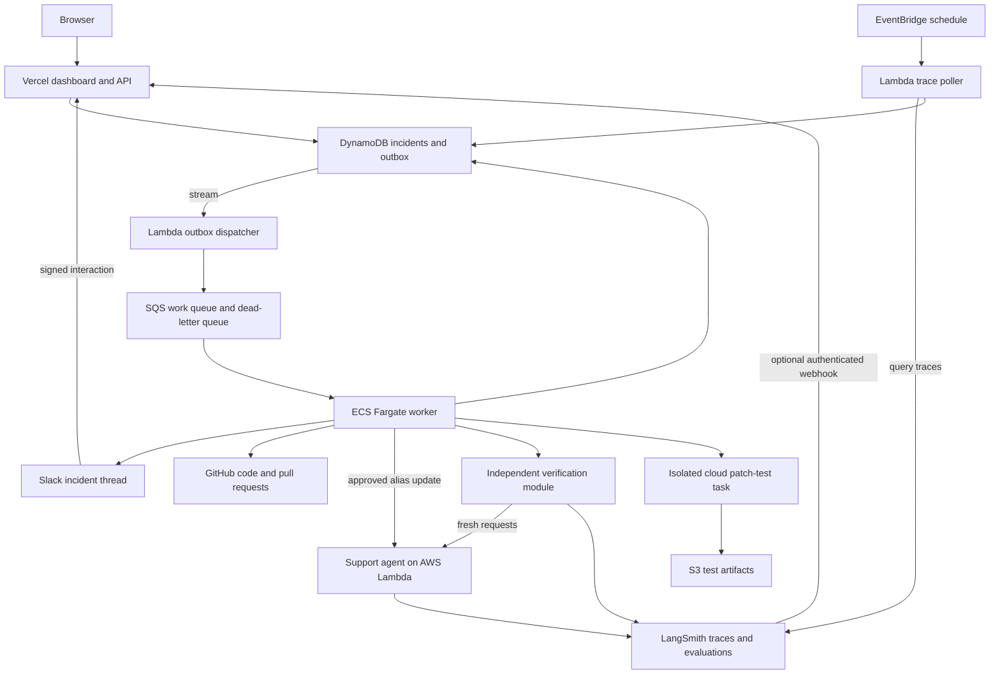

# GreenAgain — implementation and delivery plan

Status: DRAFT FOR USER REVIEW. Creating this document does not authorize implementation, cloud provisioning, publishing, or delegation. Begin those activities after the user reviews this plan and requests the build.

Prepared: September 13, 2026.

Target repository: `/Users/madhugarudala/Desktop/Code/Multi-App AI Agent Hackathon(Sep 13)/GreenAgain`.

## 1. Product definition

GreenAgain detects regressions in a deployed AI application, investigates production traces and release changes, dispatches a specialist to restore a release or prepare a tested repair, and verifies actual application behavior before closing the incident.

The defining outcome is a measured recovery caused by a real external action. A recommendation, successful deployment API response, or opened pull request is not recovery.

Everything needed to operate the product runs in the cloud. Development can happen locally, but closing the laptop must not stop monitoring, processing, verification, Slack interactions, or access to the dashboard.

### User decisions already established

- Product name: GreenAgain.
- Monitoring and evaluation: LangSmith, replacing Grafana.
- External integrations: LangSmith, Slack, GitHub, AWS.
- Dashboard and public callback endpoints: Vercel.
- Three reasoning agents: orchestrator, release recovery specialist, code repair specialist.
- Independent verifier: predominantly deterministic evaluation, not a fourth unrestricted remediation agent.
- User reviews this plan before build work starts.
- After approval, smaller Luna agents may implement bounded modules; the lead agent owns integration and review.
- Existing PulseOps is reference material. Any reused code must be disclosed. This project must implement real integrations, execution, and verification beyond PulseOps' analysis and scripted recovery.

### Hackathon fit

The brief requires one useful, multi-step agent operating across at least three external apps. Multi-agent architecture is optional; our four integrations satisfy the proposed architecture's app count, subject to actual implementation.

| Criterion | Weight from supplied brief | Evidence we will provide |
|---|---:|---|
| Technical execution | 30% | Real trace ingestion, specialist routing, cloud version change, tested PR |
| Reliability and evaluation | 25% | Regression dataset, independent verification, retry and failure tests |
| Usefulness | 20% | Restore an AI application and produce actionable repair evidence |
| Originality | 15% | Recover semantic agent failures as well as exceptions |
| Demo clarity | 10% | Visible failure, investigation, external action, measured recovery |

Submission: accessible repository, README explaining purpose/integrations/setup/reliability, and a roughly two-minute demo linked in the README. Put the short system/reliability brief in the repository. The supplied deadline is 4 PM Pacific on September 13; recheck remaining time when implementation begins. This is a phased specification, not a promise that all scope fits the remaining hackathon window.

## 2. Two applications, with separate failure boundaries

### A. GreenAgain control system

Owns incidents, agents, integration clients, action policy, approvals, verification, and the dashboard. It remains available when the monitored agent fails.

### B. Monitored support agent

A small AWS Lambda application handles fictional order and returns questions. It uses an LLM and tools backed by synthetic fixtures:

- `lookup_order`: fetch order details.
- `read_return_policy`: fetch the applicable policy.
- `check_replacement_eligibility`: calculate eligibility from explicit facts.

Output is structured: decision, cited policy identifier, order identifier, explanation, and tool outcomes. It cannot issue real refunds or contact real customers.

Instrument root requests, model calls, and tool calls in LangSmith. Tag traces with application, environment, deployed function version, release identifier, commit SHA, prompt version, source (traffic/evaluation), and scenario session. Scenario identifiers are for demo administration and must be excluded from specialist evidence so they cannot reveal the answer.

Use separate LangSmith projects for monitored production traffic, GreenAgain's own traces, and verification experiments. Evaluation traffic must not trigger recursive incidents.

## 3. Cloud architecture



### Hosting responsibilities

| Component | Host | Responsibility |
|---|---|---|
| Web UI and lightweight API | Vercel | Incident views, authenticated controls, callbacks, read-only public demo |
| Durable incident data | DynamoDB | State, events, leases, action ledger, approvals, release catalog, poll cursor |
| Durable delivery | DynamoDB outbox + Streams + SQS | Commit state and pending job atomically; dispatch jobs with retries |
| Main worker | ECS Fargate | Run investigation, agents, actions, verification, reconciliation |
| Poller | EventBridge + Lambda | Scheduled LangSmith queries independent of the web application |
| Monitored agent | Lambda versions + alias | Real target deployment with reversible version routing |
| Patch test runner | Separate Fargate task | Execute constrained generated changes without operating secrets |
| Images and artifacts | ECR and private S3 | Versioned worker images, source bundles, bounded test logs |
| Runtime secrets | AWS Secrets Manager; Vercel server settings | Only credentials needed by the corresponding service |
| Operational logs | CloudWatch | Infrastructure diagnostics for GreenAgain itself |

No SQLite, laptop worker, local tunnel, or local cron is a production dependency. No long-running remediation inside a Vercel request. Browser refreshes do not control execution.

Use AWS CDK in TypeScript to define project resources. Start with one Fargate worker and low concurrency. For the demo, use public-subnet outbound access with no inbound worker ports; avoid introducing a NAT gateway solely for this workload. Revisit network design for a production product.

## 4. Exact MVP scope and priorities

### P0 — complete cloud recovery loop

1. Healthy deployed support agent produces real LangSmith traces.
2. A deliberately faulty published release produces measurable failures.
3. Cloud detection creates one incident and Slack thread.
4. Orchestrator gathers evidence and selects the release specialist.
5. Release specialist proposes the exact allowed rollback target.
6. Policy and concurrency checks permit one alias update.
7. Fresh deployed invocations and a fixed evaluation dataset confirm recovery.
8. Dashboard and Slack show verified outcome with source links.

### P1 — second specialist and stronger reliability

1. Tool contract regression routes to code repair.
2. Cloud sandbox reproduces the failure and tests a generated adapter patch.
3. Worker opens a real GitHub PR after sandbox checks pass.
4. CI tests the exact PR head and status is reflected in the incident.
5. Incident becomes `FIX_READY`, never automatically `RESOLVED`.
6. Duplicate, stale-release, unsuccessful-remediation, and restart cases are tested.

### P2 — after P0/P1 are stable

- Approval-based deployment of a repaired version and subsequent recovery verification.
- LangSmith webhook ingestion if account capabilities and timing are suitable.
- More polished charts, evaluator explanation summaries, additional incidents.

### Explicit non-goals

- General autonomous infrastructure repair across arbitrary AWS resources.
- Database migrations, dependency upgrades, arbitrary shell access, or automatic merges.
- A prompt optimization platform, multi-tenant SaaS, billing, or complex RBAC.
- Rebuilding LangSmith's native diagnosis product. GreenAgain owns the cross-app action policy and deployed recovery verification.
- Claims of universal self-healing or guaranteed root cause.

If time becomes tight, preserve P0 and report P1 honestly as incomplete. Do not fake recovery, hardcode routing to demo labels, or report seeded test results as measured results.

## 5. Demonstration scenarios

### Scenario A: semantic prompt regression

A new prompt encourages answering without retrieving policy. A request completes successfully at the HTTP/runtime level but violates a known return-policy rule or omits required tool evidence.

Expected investigation: compare failed outputs/tool calls with the verified baseline, inspect the prompt diff, and identify a release-associated regression. Correlation alone is insufficient; include a failing case reproduced against current and baseline versions where feasible.

Expected action: restore the last verified release alias target. This restores the prior package, including its prompt. Do not silently combine prompt edits and a rollback.

### Scenario B: tool contract regression

A source adapter reads `order.status`, while the fixture/tool returns `order.fulfillment.status`. The specialist sees the trace and relevant code, reproduces the exception, and proposes a small adapter correction.

The repair runner's fixed acceptance tests cover the new response shape and previously supported behavior. The agent may add a reproduction test but may not edit protected acceptance tests or CI configuration.

Expected action: a tested PR. Deployment is P2 and requires a separate exact-commit approval.

### Scenario C: remediation did not work

A controlled dependency failure persists independently of deployed code. An isolated reliability test can simulate a successful alias update followed by failed live verification. GreenAgain remains unresolved and escalates; a green AWS API result must never close the case.

Use real cloud fault injection for the end-to-end demonstration where practical, and clearly label deterministic adapter simulations in the test report.

## 6. Agent contracts

### Orchestrator

Input: normalized incident evidence, recent traces, release catalog, relevant GitHub diffs, current deployment state.

Tools: scoped trace retrieval, source/diff reads, release metadata reads. No arbitrary deployment or code execution tools.

Output: category, proposed specialist, hypothesis, evidence IDs, missing evidence, explanation, and `investigate_more`/`dispatch`/`escalate` decision.

It can request additional evidence within a bounded tool budget. At most one specialist acts at a time for one application/environment. A specialist may return a reason for reassignment, with at most one re-route in the initial implementation.

### Release recovery specialist

Input: evidence bundle, current release, candidate baseline, incident context.

Output: `rollback_release` proposal containing exact current and target versions, alias revision, evidence IDs, expected effect, and verification specification; or escalation.

The model never invents a rollback target. Targets come from the verified release catalog. A deterministic executor applies the approved typed action.

### Code repair specialist

Input: sanitized trace, bounded source context pinned to commit, failure test results, allowed paths.

Output: patch proposal, reproduction case, explanation, files changed, evidence IDs. Maximum two patch attempts in the initial implementation.

Allowed initial changes: monitored agent adapter source and additive reproduction tests. Exclude infrastructure, lockfiles, package scripts, workflows, credential code, and protected evaluation fixtures.

### Verifier

Independent module consumes deployment and action records, runs fixed tests and live requests, and returns `PASS`, `FAIL`, or `INCONCLUSIVE` with measurements and links.

Only `PASS` can enable resolution. Optional LLM explanation scoring cannot override a failed deterministic critical check. The repair agent cannot alter the verifier's dataset, thresholds, or results.

### Shared limits

- Model responses validated using Zod schemas; at most one schema-repair retry.
- Trace bodies and repository contents are untrusted data, never system instructions.
- Track model/provider usage and timeouts per incident.
- Initial proposed incident budget: ten minutes, twelve reasoning/tool rounds, two patch attempts, one rollback action. Make configurable and validate in measured runs.
- Luna is the proposed implementation model for delegated coding tasks, not an assumed production API model. Runtime provider/model selection must be validated separately using available credentials.

## 7. Incident state machine

| State | Meaning | Legal next states |
|---|---|---|
| DETECTED | Evidence accepted durably | INVESTIGATING, ESCALATED |
| INVESTIGATING | Reading evidence and selecting response | ACTION_PROPOSED, ESCALATED |
| ACTION_PROPOSED | Typed action awaits policy decision | REMEDIATING, AWAITING_APPROVAL, ESCALATED |
| AWAITING_APPROVAL | Waiting for authorized person | REMEDIATING, ESCALATED |
| REMEDIATING | Action or patch work in progress | VERIFYING, FIX_READY, ESCALATED |
| VERIFYING | Checking deployed behavior | RESOLVED, ESCALATED |
| FIX_READY | PR and required CI checks passed | AWAITING_APPROVAL, ESCALATED |
| RESOLVED | Deployed recovery criteria passed | New related incident if regression returns |
| ESCALATED | Automation stopped with explanation | Explicit authorized resume after revalidation |

Persist events such as `evidence_added`, `specialist_dispatched`, `policy_checked`, `action_started`, `action_observed`, `verification_completed`, and `notification_pending` separately from state. Notification failure does not erase a real recovery result.

State changes use conditional writes against a revision number. Approval events bind to action hash, exact release/commit, incident revision, approver identity, and expiry. Stale or duplicate approvals cannot authorize a different action.

## 8. Detection and durable processing

### Default detection

EventBridge invokes a poller every minute. Query recent completed monitored root traces with an overlap window and a persisted cursor. Paginate results and deduplicate by provider trace ID. Account for delayed trace ingestion; replay an overlap window rather than treating timestamps as exact delivery order.

Suggested initial configurable triggers:

- Two equivalent root errors within five minutes for one app/environment/release.
- A critical deterministic policy check failure in controlled canary traffic.
- Missing expected evaluation feedback is unknown, not a healthy result.

A cloud canary invokes the support agent with a small fixed sample and attaches deterministic feedback. Production detection uses these observations; the dataset used for final verification remains versioned and broader. Do not depend on paid online evaluator access without checking the account.

### Optional webhook

Validate configured authentication and payload size. Normalize to the same event schema as polling. Store durably before acknowledging. Measure actual provider delivery behavior; threshold windows and automation schedules may not fit a short demo.

### Atomic ingestion and outbox

Use a DynamoDB transaction to insert the source-event deduplication record and a pending outbox job. Stream-triggered dispatcher sends the job to SQS and marks it sent. Duplicate stream delivery may send duplicate queue jobs, which consumers must tolerate.

Use a scheduled reconciliation pass for pending outbox records and failed dispatches. An AWS enqueue failure must not leave an acknowledged event permanently unprocessed.

### Worker

Long-poll SQS, acquire a conditional incident lease, process a bounded step, persist progress, and acknowledge only after state is durable. Extend visibility and lease while actively working. Initial targets: 120-second visibility with 30-second heartbeats; validate against measured steps.

Do not hold a queue message or active task while waiting hours for approval or CI. Persist a waiting state and resume from a callback or scheduled reconciliation job. Send messages repeatedly failing processing to a dead-letter queue with a visible operational alert.

### External action ledger

Store action intent and idempotency key before the external call. On uncertain response, inspect external state before retrying:

- AWS: compare alias target and revision; never overwrite an unrelated newer deployment.
- GitHub: find an existing branch/PR using deterministic incident metadata and compare content before creating another.
- Slack: track root message timestamp and reconcile uncertain sends where possible; do not promise exactly-once third-party delivery.

SQS is at-least-once delivery. Internal leases, conditional state changes, and external reconciliation provide the protection, not an assumption of exactly-once execution.

## 9. Data contracts and storage

Define and export shared TypeScript types with runtime Zod validators before delegating dependent modules.

| Entity | Required fields |
|---|---|
| SourceEvent | source, sourceEventId, traceId, app, environment, releaseId, occurredAt, receivedAt, evidenceRef |
| Incident | id, fingerprint, app, environment, releaseId, state, revision, timestamps, summary, activeActionId, slackThreadRef |
| Evidence | id, incidentId, source, externalRef, observedAt, sanitizedSummary, contentHash, artifactRef |
| AgentDecision | agentRole, schemaVersion, decision, evidenceIds, missingEvidence, model, usage, duration |
| Action | id, incidentId, kind, parameters, targetHash, status, idempotencyKey, policyResult, externalRef |
| Approval | actionId, targetHash, incidentRevision, userId, decision, expiresAt, consumedAt |
| Release | app, environment, commitSha, lambdaVersion, promptVersion, artifactHash, verificationRef, verifiedAt |
| Verification | incidentId, actionId, datasetVersion, executedVersion, experimentRef, criticalPassed, totalPassed, total, status |
| Job | id, kind, incidentId, expectedRevision, attempt, notBefore, createdAt |

Suggested DynamoDB layout: incident partition with `META`, timestamped `EVENT`, `EVIDENCE`, `ACTION`, and `VERIFY` items; separate partitions for release catalog, source deduplication, poll cursor, environment lease, outbox, and approvals. Add indexes for incident list by environment/status and pending outbox work. Keep large evidence in private S3 with hashes and bounded retention.

Raw trace content must not appear automatically in public dashboard payloads. Public views contain sanitized summaries and measured results. External deep links respect provider access controls.

## 10. HTTP and integration interfaces

| Route | Access | Behavior |
|---|---|---|
| GET /api/health | Public sanitized | Web process status; no secret values |
| GET /api/incidents | Public sanitized demo or operator | Paginated incident summaries |
| GET /api/incidents/:id | Public sanitized demo or operator | State, evidence summaries, measurements |
| GET /api/incidents/:id/events | Same as incident | Cursor-based event polling |
| POST /api/webhooks/langsmith | Authenticated provider | Normalize, deduplicate, durable enqueue |
| POST /api/webhooks/slack | Slack signed | Acknowledge quickly, validate operator, record approval |
| POST /api/webhooks/github | GitHub signed | Record CI/check result; reconcile exact commit |
| POST /api/demo/scenarios | Operator only | Queue controlled faulty release and traffic generation |
| POST /api/demo/reset | Operator only | Restore baseline and reset scenario state without deleting history |
| POST /api/incidents/:id/approve | Operator session + CSRF | Exact-action approval |
| POST /api/incidents/:id/resume | Operator only | Revalidate and queue continuation |

Use a server-side operator login with signed, secure, HTTP-only session cookies and an explicit user allowlist. For a single-operator hackathon build, a deployment-configured login secret is acceptable if never embedded in browser code, URLs, logs, or public documentation. Do not expose fault injection or remediation through public unauthenticated controls.

UI event polling every few seconds is sufficient initially. No dependence on persistent browser sockets or long-lived Vercel responses.

Adapter interfaces: `TraceSource`, `IncidentStore`, `JobPublisher`, `ReleaseController`, `SourceRepository`, `IncidentNotifier`, `RepairRunner`, `EvaluationRunner`, `ModelClient`. Each returns typed results and distinguishes transient errors, authentication errors, not-found state, and inconclusive results.

## 11. AWS release and repair execution

### Releases

Publish immutable Lambda versions and maintain one demo production alias. Store verified baseline metadata before permitting rollback. Invoke the alias using authenticated AWS SDK requests from cloud workers; a public Lambda URL is unnecessary for the initial demo.

Before rollback, fetch alias target and revision again. Verify application/environment allowlist, known-good target, and no incompatible release metadata. Use conditional revision protection. Afterward, read alias state and include the actual executed function version on every verification invocation.

Do not assume the previous numeric version is healthy. A baseline needs a recorded evaluation pass.

### Cloud patch runner

The trusted worker builds a source bundle pinned to a commit and a validated patch, then uploads it to a private artifact location. A disposable Fargate task downloads only the assigned bundle, applies the patch, and runs a fixed test command with a timeout.

The runner has no Slack, GitHub, model-provider, LangSmith, or application credentials, and no permission to update Lambda. Its task role is limited to the required artifact/log paths. Keep image-pull execution permissions separate from task permissions. Disable privileged execution and avoid exposing host sockets.

Runtime code cannot edit the fixed test harness or forge a successful result merely by printing a success message. The trusted runner records exit codes, protected test results, input commit, and patch hash. The main worker validates these before opening a PR.

CI reruns protected checks on the exact PR head. No `pull_request_target` execution of candidate code with privileged secrets. A PR becoming stale invalidates previous acceptance results.

## 12. Recovery acceptance rules

Create a fixed dataset of approximately 12–20 cases. Include successful returns, ineligible returns, policy boundary dates, damaged items, missing orders, malformed tool results, and prior supported response shapes.

Protected checks:

- Output schema valid.
- Order identity correct.
- Required tools consulted.
- Policy citation and eligibility correct.
- No unexpected exception.
- All critical baseline cases remain passing.

Evaluate baseline and candidate against the same dataset version. Capture actual deployed version and trace links. Optional explanation quality scoring is secondary.

Initial resolution gate: all protected critical tests pass; no loss against the recorded baseline on the fixed suite; three fresh representative alias invocations succeed across a short observation period; all invoke the expected version. These are demo acceptance rules, not statistical proof of production-wide reliability.

LangSmith or provider unavailability yields `INCONCLUSIVE`, not a fabricated pass. Historical bad traces remain historical; verification uses new requests rather than expecting old error counts to disappear immediately.

## 13. Dashboard specification

### Overview

- GreenAgain identity and concise purpose.
- Integration connectivity with last checked time; distinguish connected, stale, degraded, and unconfigured.
- Active incidents, current release, last verified release, recent verified recoveries.
- Incident list showing state, affected app, first seen, specialist, and outcome.

### Incident detail

- Current state and a one-sentence explanation.
- Timeline: detection, evidence, specialist selection, policy, external action, verification.
- Evidence cards with sanitized trace summaries and source references.
- Before/after evaluation counts and actual experiment links.
- AWS release before and after; GitHub PR and CI result when relevant.
- Slack thread link and delivery state.
- Exact pending action and operator approval controls.
- Clear `FIX_READY`, `INCONCLUSIVE`, and `ESCALATED` presentations.

### Demo controls

Authenticated operators select a scenario and generate real traffic. Clearly label intentional fault injection. Allow one active scenario per environment. Reset restores a known-good version and records an audit event; it does not erase incident history.

Use concise evidence-based agent explanations, not hidden reasoning transcripts. Every status indicator comes from persisted state. Empty and failed integration states must be readable.

## 14. Proposed repository layout

```text
apps/
  web/                     Next.js dashboard and callback API
  worker/                  Fargate queue consumer and orchestration
  monitored-agent/         Lambda support agent, prompts, tool adapter
  poller/                  Scheduled trace/canary/reconciliation handlers
  repair-runner/           Restricted cloud test harness
packages/
  contracts/               Zod schemas, enums, adapter interfaces
  core/                    State machine, policy, orchestration, verification
  integrations/            LangSmith, Slack, GitHub, AWS clients
  storage/                 DynamoDB repositories, outbox, leases
  evals/                   Protected dataset and evaluators
  ui/                      Shared components if actually needed
infra/                     CDK stacks, IAM, queues, worker service
tests/
  unit/
  integration/
  cloud-e2e/
docs/
  architecture.md
  reliability.md
  demo-script.md
  operations.md
plan.md
README.md
.env.example
.github/workflows/
```

Use npm workspaces, TypeScript, Zod, AWS SDK v3, LangSmith SDK, and one validated runtime model provider. Lock dependencies and verify deployed runtime compatibility during foundation work. Pin a stable Next.js version after checking its documentation. No agent framework is required for this bounded state machine.

## 15. Configuration and capability preflight

Repository inspection established an initial repository and local environment configuration, not working cloud authentication. No secret values belong in this document. A swap file was visible beside the environment file; ignore editor swap files as part of foundation hygiene without deleting user files.

Check, after build authorization:

- Actual Git remote/default branch, repository visibility, and ability to create branches/PRs/checks.
- AWS caller identity, selected region, allowed provisioning scope, service quotas, and available budget.
- Vercel identity, team/project target, deployment permissions, and public callback behavior.
- LangSmith project read/write, dataset/experiment operations, quotas, webhook availability, and observed ingestion delay.
- Slack workspace, bot installation, channel membership, signed interaction configuration, operator IDs.
- One working model provider and actual supported runtime model ID.

Expected configuration categories (names finalized in `.env.example`):

| Category | Examples | Deployed location |
|---|---|---|
| Bootstrap | AWS_ACCESS_KEY_ID, AWS_SECRET_ACCESS_KEY, AWS_REGION, VERCEL_API_KEY | Development/provisioning only |
| LangSmith | LANGSMITH_API_KEY, LANGSMITH_ENDPOINT, monitored/control project names | Scoped worker/poller/demo settings |
| Model | Provider API key and model ID | Worker and monitored agent only |
| Slack | Bot token, signing secret, channel ID, operator allowlist | Worker and callback server as needed |
| GitHub | App credentials or repository-scoped token, webhook secret, repository | Worker and callback server as needed |
| Infrastructure | Table, queue, artifact bucket, function alias, task definition | Generated deployment outputs |
| Operator access | Session signing secret and login configuration | Vercel server only |

Prefer AWS runtime roles, GitHub-to-AWS OIDC for deployment, and Vercel-to-AWS OIDC with narrowly scoped trust. Do not ship bootstrap AWS or Vercel deployment keys to repair tasks. Any fallback static runtime credential must be narrowly scoped, server-only, and documented.

Cloud hosting incurs usage costs; AWS account creation does not imply every service is free. During provisioning, estimate the selected region's costs, configure a budget alert, tag resources, cap worker/task concurrency, set log/artifact retention, and provide teardown instructions. Avoid a made-up fixed price before resources and account allowances are checked.

## 16. Testing and acceptance matrix

| Test | Level | Required result |
|---|---|---|
| Invalid agent JSON | Unit | One repair retry, then explicit failure |
| Duplicate trace/webhook | Integration | Same incident, no duplicate action |
| Outbox dispatch fails | Integration | Pending work reconciles and eventually queues |
| Queue redelivery | Integration | Lease/action ledger prevents conflicting execution |
| Crash after AWS action | Integration/cloud | Observe existing alias change before retry |
| New release during investigation | Integration | Stale action refused |
| Rollback API success, checks fail | Integration/cloud | Escalation, never resolved |
| Missing LangSmith data | Integration | Inconclusive/degraded, never green |
| Foreign or expired Slack approval | Integration | No action |
| Patch edits prohibited path | Unit | Rejected before execution |
| Protected tests fail | Integration | No accepted repair PR or deployment |
| PR head changes after checks | Integration | Previous verification invalidated |
| Trace contains hostile instructions | Unit/integration | No expanded tools or altered policy |
| Model outage or timeout | Integration | Bounded retry and durable escalation |
| Laptop offline | Cloud E2E | Scheduled detection and remediation continue |
| Semantic regression | Cloud E2E | Real rollback and fixed evaluation pass |
| Tool regression | Cloud E2E | Real tested PR and correct FIX_READY state |

Record actual counts, duration, test environment, commit, and limitations. Separate fixture-based reliability tests from live cloud runs. Do not claim calibration, uptime, latency improvements, or pass rates that were not measured.

## 17. Build phases and exit gates

### Phase 0 — user review

Review this document, scope, operator actions, and hosting choice. Resolve changes before implementation. No Luna tasks are dispatched during plan creation.

### Phase 1 — foundation and contracts

Lead defines schemas, state transitions, interfaces, directory ownership, dependency versions, and infrastructure outputs. Add `.env.example`, editor/secret ignores, lint/typecheck/build/test scripts. Verify credentials without printing values. Initialize the baseline repository once authorized.

Exit: all downstream interfaces compile; capability preflight is recorded; cloud resources required are concrete.

### Phase 2 — cloud skeleton and monitored agent

Provision storage/outbox/queue/worker/poller resources; deploy a minimal Vercel UI; publish the healthy Lambda support agent; establish LangSmith traces and baseline dataset. Establish signed/authenticated callbacks and operator access.

Exit: browser shows a cloud-generated incident event and healthy agent traces; no laptop dependency.

### Phase 3 — P0 recovery loop

Implement orchestrator, release specialist, policy executor, cloud detection, Slack thread, baseline release catalog, and deployed verifier. Publish faulty prompt version and run the complete recovery.

Exit: real fault -> real incident -> real alias restoration -> fresh evaluated pass -> Slack resolution.

### Phase 4 — P1 repair loop

Implement restricted patch runner, code specialist, GitHub PR adapter, exact-head CI reconciliation, and FIX_READY state. Run tool-contract regression.

Exit: reproduced failure, generated patch, protected tests pass, accessible PR with CI evidence.

### Phase 5 — reliability and presentation

Run failure matrix, verify restart behavior, polish actual dashboard data, record limitations and measured results. Run the laptop-off cloud check. Only add P2 after core gates pass.

### Phase 6 — submission

Create concise README and reliability brief, record roughly two-minute demo, verify repository and video access, and perform final credential/artifact review. Public dashboard supports safe read-only judging. Do not submit until the user authorizes the submission itself.

## 18. Luna delegation plan

Use at most three concurrent Luna implementers alongside the lead. Model choice is the user's requested Luna model. Do not delegate architecture choices or final integration responsibility implicitly.

Each task gets: exact allowed files, frozen interface version, dependencies, example inputs/outputs, acceptance tests, prohibited scope, and a required handoff summary. Agents must not edit each other's files, modify shared contracts without agreement, provision cloud resources independently, send Slack messages, or push branches unless their assignment explicitly includes that authority.

### Wave A — after contracts exist

| Task | Owner scope | Acceptance |
|---|---|---|
| A1 Monitored application | apps/monitored-agent, fixture-specific tests | Healthy agent and both reproducible regressions; metadata instrumentation |
| A2 Observability and notification adapters | LangSmith/Slack files in packages/integrations, adapter tests | Typed querying, feedback, notifications, signed callback validation |
| A3 Dashboard | apps/web UI components and read views | All state views work with contract fixtures, no fabricated metrics |

Lead owns contracts, storage/outbox, IAM/CDK, deployment skeleton, and orchestration. UI fixtures are development-only and must be replaced with real cloud reads before demo acceptance.

### Wave B — after Wave A integration

| Task | Owner scope | Acceptance |
|---|---|---|
| B1 Evaluation module | packages/evals, verifier-specific tests | Protected dataset, objective scores, PASS/FAIL/INCONCLUSIVE |
| B2 Repair runner | apps/repair-runner, runner tests | Constrained execution, immutable harness, signed-off artifact contract |
| B3 GitHub adapter | GitHub integration files and tests | Pinned source reads, idempotent PR creation, exact-head check status |

Lead owns release execution, worker lifecycle, cloud deployment, integration reconciliation, and review of all external write paths.

### Wave C — optional final bounded work

Documentation, dashboard polish, and specific uncovered reliability tests. Avoid launching broad new features near submission.

### Required handoff from every agent

- Files changed and interface versions used.
- Actual checks run and results.
- Remaining placeholders and assumptions.
- Any integration/configuration dependency.
- Explicit statement of external actions taken, if any.

Lead independently reviews changes and runs combined tests. Passing unit tests alone does not complete a delegated integration task.

## 19. Demo storyboard

Suggested edited two-minute recording; show real measurements and label cuts when useful:

1. 0–15 seconds: explain GreenAgain and show healthy support-agent behavior.
2. 15–30 seconds: operator deploys faulty release and generates real requests.
3. 30–55 seconds: show LangSmith evidence, Slack incident, and specialist dispatch.
4. 55–85 seconds: show AWS alias change and new verification results.
5. 85–105 seconds: show tool-repair PR and CI evidence from a separate recorded run.
6. 105–120 seconds: show failed-remediation escalation and reliability summary.

Do not imply the full process completed in two minutes if edited cloud waits were longer. Record actual incident durations. Prove recovery with the failing user operation, not just a health endpoint.

## 20. Definition of done

- [ ] User approved the plan and requested implementation.
- [ ] Entire operating system is deployed to cloud services.
- [ ] Four integrations perform real, necessary actions/reads.
- [ ] Three reasoning agent roles have bounded, distinct responsibilities.
- [ ] Semantic regression triggers real recovery on AWS.
- [ ] Recovery is based on independent fresh evaluation.
- [ ] Tool repair produces a tested real PR, if P1 is claimed.
- [ ] Duplicates, stale state, failed remediation, and restarts handled.
- [ ] Public dashboard has no exposed operational controls or raw secrets.
- [ ] Slack updates and approvals bind to actual incident state.
- [ ] README, measured reliability report, deployment/teardown instructions complete.
- [ ] Demo accessible; reused PulseOps material disclosed if applicable.
- [ ] Actual limitations and incomplete phases stated clearly.

## 21. Verified references and remaining uncertainties

Official documentation consulted for this design:

- [LangSmith tracing queries](https://docs.langchain.com/langsmith/export-traces)
- [LangSmith evaluation](https://docs.langchain.com/langsmith/evaluate-llm-application)
- [LangSmith alerting](https://docs.langchain.com/langsmith/alerts)
- [LangSmith automation webhooks](https://docs.langchain.com/langsmith/webhooks)
- [LangSmith pricing and plan features](https://www.langchain.com/pricing)
- [AWS Lambda aliases](https://docs.aws.amazon.com/lambda/latest/dg/configuration-aliases.html)
- [SQS visibility and at-least-once delivery](https://docs.aws.amazon.com/AWSSimpleQueueService/latest/SQSDeveloperGuide/sqs-visibility-timeout.html)
- [Vercel AWS identity federation](https://vercel.com/docs/oidc/aws)

Account-level API permissions, LangSmith automation eligibility, actual provider model access, AWS quotas/costs, Vercel project identity, Slack bot setup, and GitHub write authentication have not yet been validated. Local presence of configuration values does not establish those capabilities.

This document is a reviewable implementation specification. No application, infrastructure, integration, or evaluation result is represented as already built.
